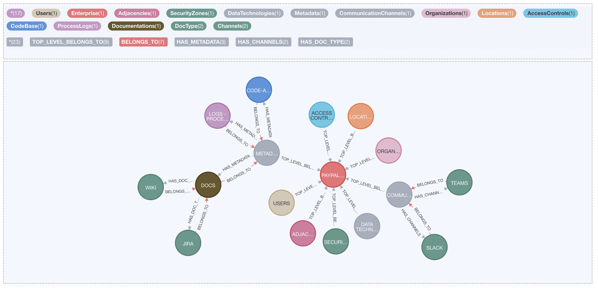

### GEM | Graph of Enterprise Metadata 

Code base for the proof of concept on the Graph of Enterprise Metadata

#  

--------------------------------------------------------------------------------------------------------------------

### Quick Start

* [Pull the repo](https://github.com/Dee-Pac/GEM)

* [Start neo4j](https://github.com/Dee-Pac/GEM)

* [Start GraphQl](https://github.com/Dee-Pac/GEM)

* [Bootstrap GEM in neo4j](https://github.com/Dee-Pac/GEM)

* [Play with GEM on neo4j](https://github.com/Dee-Pac/GEM)

* [Play with GEM via GraphQL](https://github.com/Dee-Pac/GEM)

--------------------------------------------------------------------------------------------------------------------

### Questions

* [Contact on Glitter](https://github.com/Dee-Pac/GEM)

--------------------------------------------------------------------------------------------------------------------

### Contributing

* [Please read the contributor guidelines](https://github.com/Dee-Pac/GEM)

