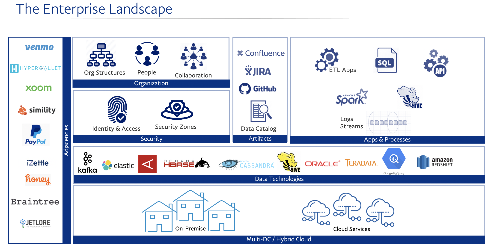
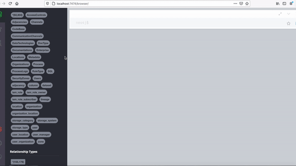

### GEM | Graph of Enterprise Metadata 

[](https://gitter.im/graph_of_enterprise_metadata/GEM-Ask-Us-Anything?utm_source=badge&utm_medium=badge&utm_campaign=pr-badge&utm_content=badge)
[](https://app.codacy.com/gh/Dee-Pac/GEM?utm_source=github.com&utm_medium=referral&utm_content=Dee-Pac/GEM&utm_campaign=Badge_Grade)


### Introduction

Modern enterprises not only have a myriad of data sources, from real-time events, transactional, Big Data, and many other systems, but they also boast a rich ecosystem of thousands of APIs & treasure of deep technical metadata. How do you organize and gain insights from all of this? In addition, there is a trove of data coming from other sources such as millions of datasets, SQL queries, slack chats, thousands user hierarchies, orgs & locations, access controls, Wiki pages, JIRA tickets and more. Normally, these sources are all disconnected from each other, and valuable insights are missed.

The Graph of Enterprise Metadata is a system that connects and puts all the critical metadata under one umbrella. GEM is built on top of Neo4j and Apache Spark and sports a range of metadata ingestion components. GEM manages a rich graph of entities and connections, it applies graph algorithms for analysis and recommendations. And in the future - GEM would apply ML model to derive insights. These help answer critical questions around data catalog, security, and governance initiatives for systems supporting financial transactions for our 346 millions of users. In addition, we envision this graph of enterprise metadata to empower PayPal at scale & accelerate the journey of reaching 1 Billion Customers.

--------------------------------------------------------------------------------------------------------------------

# Gimel overview

## [2020 - Enterprise Metadata Graph | Nodes Online by NEO4J](https://neo4j.com/nodes-2020/agenda/)
* [Click here for slideshare](https://www.slideshare.net/DeepakMC/graph-of-enterprisemetadata-nodes2020-neo4j-conference)
[](https://youtu.be/m_beM8EuPy8)

## [2020 - Lightning Talk | Metadata Day @ LinkedIn](https://metadataday2020.splashthat.com/)
* [Click here for slideshare](https://www.slideshare.net/DeepakMC/data-orchestration-2020-alluxio-gimel-240334331)
[]()

--------------------------------------------------------------------------------------------------------------------


#### View of Enterprise Landscape

# 

#### Transformed into Graph of Enterprise Metadata




--------------------------------------------------------------------------------------------------------------------

### NODES2020 Conference

- #### [Agenda](https://neo4j.com/nodes-2020/agenda/)
- #### [View in Slideshare](https://www.slideshare.net/DeepakMC/graph-of-enterprisemetadata-nodes2020-neo4j-conference)
- #### [View as PDF](docs/pdfs/NODES2020_Talk.pdf)
- #### [Video Stream](https://www.bigmarker.com/neo4j-event/Mastering-Enterprise-Metadata-with-Neo4j?bmid=116f67e48bad)


--------------------------------------------------------------------------------------------------------------------

### Quick Start

#### Clone the Repo
```bash
# Clone the repo
git clone git@github.com:Dee-Pac/GEM.git

# Open the GEM repo
cd GEM

# make sure we are on "main" branch
git checkout origin main
```

#### Start neo4j & GraphQL
```bash
# make sure you are in the GEM directory...

# Fire-up the stack 
# - Starts a new docker network
# - Starts neo4j
# - bootstraps sample data & model
# - Starts GraphQL 

sh start.sh
```

* Following indicates successfull start of the stack
```

***********************************************************************************************
*                                 Firing Up NEO4J ...                                         *
***********************************************************************************************
...
..
***********************************************************************************************
*                          Bootstrapping neo4j with GEM data ...                              *
***********************************************************************************************
...
..
***********************************************************************************************
*                                Firing up GraphQL ...                                        *
***********************************************************************************************
...
..
***********************************************************************************************
*                     SUCCESS | Starting Graph of Enterprise Metadata                         *
***********************************************************************************************

---------------------- NEO4J Docker Environment ------------------------------
Successfully Launched neo4j docker container [gem_neo4j]
Accessing Docker Container : docker exec -it gem_neo4j bash
Accessing Via browser : http://localhost:7474/browser/
neo4j logs : <PATH_TO_REPO>/GEM/neo4j/logs/debug.log
------------------------------------------------------------------------------

----------------------- GraphQL Docker Environment ---------------------------
Successfully Launched GraphQL docker container [gem_api]
Accessing Docker Container : docker exec -it gem_api bash
Accessing Via browser : http://localhost:3000
------------------------------------------------------------------------------
```
#### Stop neo4j & GraphQL
```bash

# Stops all the containers, remove the gem docker network.

sh stop.sh
```

* Following indicates the stack has been cleaned off from the local environment
```bash
...
..
Stopping container if already running [gem_neo4j]...
Removing container if exists [gem_neo4j]...
Removing image if exists [gem_neo4j]...
Cleaning up already existing image and container [gem_api] ...
...
..
2020-10-20 12:13:11 | ------------------------------------------------------------------------------
2020-10-20 12:13:11 | Cleaning up networks ...
2020-10-20 12:13:11 | ------------------------------------------------------------------------------
2020-10-20 12:13:11 | Executing Command --> docker network rm gem_net
gem_net
2020-10-20 12:13:11 | SUCCESS
```


--------------------------------------------------------------------------------------------------------------------

### Questions

* [Contact on Gitter](https://gitter.im/graph_of_enterprise_metadata/GEM-Ask-Us-Anything)

--------------------------------------------------------------------------------------------------------------------

### Contributing

* [Please read the contributor guidelines](https://github.com/Dee-Pac/GEM)


