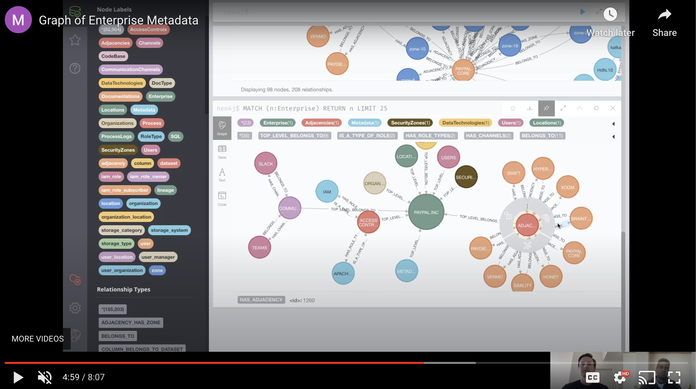

# GEM | Graph of Enterprise Metadata 

[](https://gitter.im/graph_of_enterprise_metadata/GEM-Ask-Us-Anything?utm_source=badge&utm_medium=badge&utm_campaign=pr-badge&utm_content=badge)
[](https://app.codacy.com/gh/Dee-Pac/GEM?utm_source=github.com&utm_medium=referral&utm_content=Dee-Pac/GEM&utm_campaign=Badge_Grade)


# Introduction

Modern enterprises not only have a myriad of data sources, from real-time events, transactional, Big Data, and many other systems, but they also boast a rich ecosystem of thousands of APIs & treasure of deep technical metadata. How do you organize and gain insights from all of this? In addition, there is a trove of data coming from other sources such as millions of datasets, SQL queries, slack chats, thousands user hierarchies, orgs & locations, access controls, Wiki pages, JIRA tickets and more. Normally, these sources are all disconnected from each other, and valuable insights are missed.

The Graph of Enterprise Metadata is a system that connects and puts all the critical metadata under one umbrella. GEM is built on top of Neo4j and Apache Spark and sports a range of metadata ingestion components. GEM manages a rich graph of entities and connections, it applies graph algorithms for analysis and recommendations. And in the future - GEM would apply ML model to derive insights. These help answer critical questions around data catalog, security, and governance initiatives for systems supporting large scale enterprise.

--------------------------------------------------------------------------------------------------------------------

# GEM overview

### [2020 - Enterprise Metadata Graph | Nodes Online by NEO4J](https://neo4j.com/nodes-2020/agenda/)
* [Click here for slideshare](https://www.slideshare.net/DeepakMC/graph-of-enterprisemetadata-nodes2020-neo4j-conference)
[](https://youtu.be/m_beM8EuPy8)

### [2020 - Lightning Talk | Metadata Day @ LinkedIn](https://metadataday2020.splashthat.com/)
[](https://youtu.be/pCuIYK1D9FE)

--------------------------------------------------------------------------------------------------------------------


# View of Enterprise Landscape

# 

# Transformed into Graph of Enterprise Metadata


--------------------------------------------------------------------------------------------------------------------

### Quick Start

#### Clone the Repo
```bash
# Clone the repo
git clone git@github.com:Dee-Pac/GEM.git

# Open the GEM repo
cd GEM

# make sure we are on "main" branch
git checkout origin main
```

#### Start neo4j & GraphQL
```bash
# make sure you are in the GEM directory...

# Fire-up the stack 
# - Starts a new docker network
# - Starts neo4j
# - bootstraps sample data & model
# - Starts GraphQL 

sh start.sh
```

* Following indicates successfull start of the stack
```

***********************************************************************************************
*                                 Firing Up NEO4J ...                                         *
***********************************************************************************************
...
..
***********************************************************************************************
*                          Bootstrapping neo4j with GEM data ...                              *
***********************************************************************************************
...
..
***********************************************************************************************
*                                Firing up GraphQL ...                                        *
***********************************************************************************************
...
..
***********************************************************************************************
*                     SUCCESS | Starting Graph of Enterprise Metadata                         *
***********************************************************************************************

---------------------- NEO4J Docker Environment ------------------------------
Successfully Launched neo4j docker container [gem_neo4j]
Accessing Docker Container : docker exec -it gem_neo4j bash
Accessing Via browser : http://localhost:7474/browser/
neo4j logs : <PATH_TO_REPO>/GEM/neo4j/logs/debug.log
------------------------------------------------------------------------------

----------------------- GraphQL Docker Environment ---------------------------
Successfully Launched GraphQL docker container [gem_api]
Accessing Docker Container : docker exec -it gem_api bash
Accessing Via browser : http://localhost:3000
------------------------------------------------------------------------------
```
#### Stop neo4j & GraphQL
```bash

# Stops all the containers, remove the gem docker network.

sh stop.sh
```

* Following indicates the stack has been cleaned off from the local environment
```bash
...
..
Stopping container if already running [gem_neo4j]...
Removing container if exists [gem_neo4j]...
Removing image if exists [gem_neo4j]...
Cleaning up already existing image and container [gem_api] ...
...
..
2020-10-20 12:13:11 | ------------------------------------------------------------------------------
2020-10-20 12:13:11 | Cleaning up networks ...
2020-10-20 12:13:11 | ------------------------------------------------------------------------------
2020-10-20 12:13:11 | Executing Command --> docker network rm gem_net
gem_net
2020-10-20 12:13:11 | SUCCESS
```


--------------------------------------------------------------------------------------------------------------------

### Questions

* [Contact on Gitter](https://gitter.im/graph_of_enterprise_metadata/GEM-Ask-Us-Anything)

--------------------------------------------------------------------------------------------------------------------

### Contributing

* [Please read the contributor guidelines](https://github.com/Dee-Pac/GEM)


